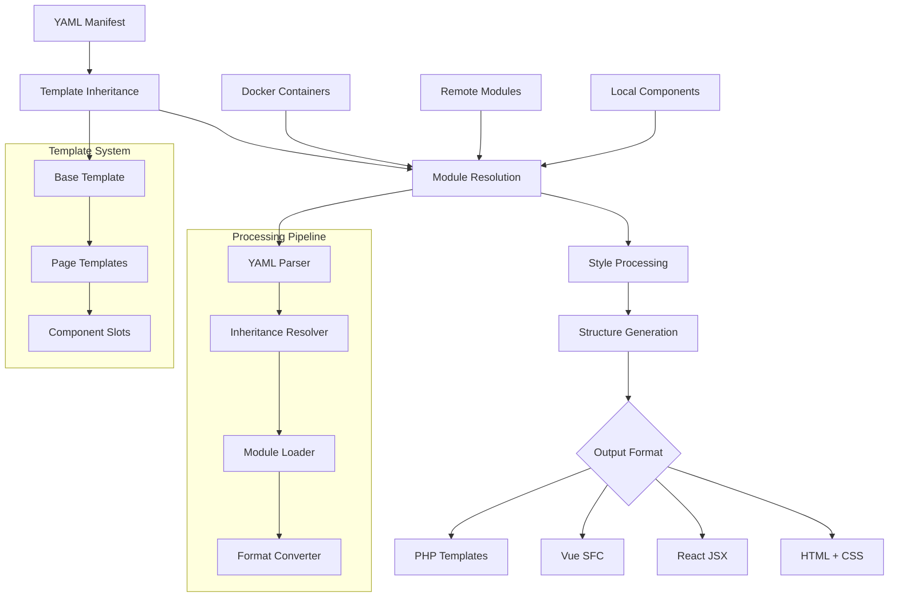
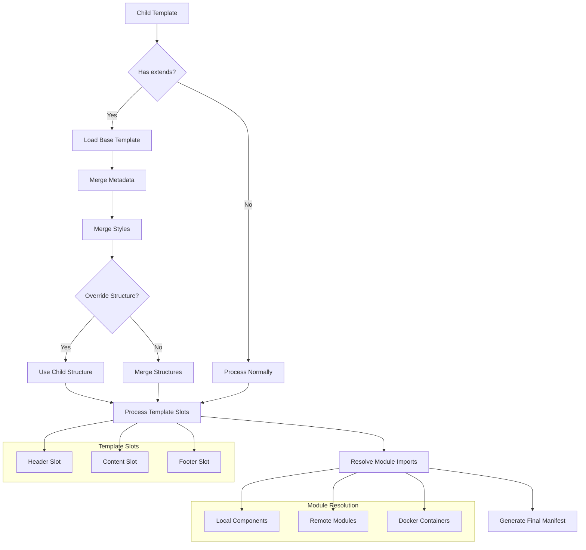
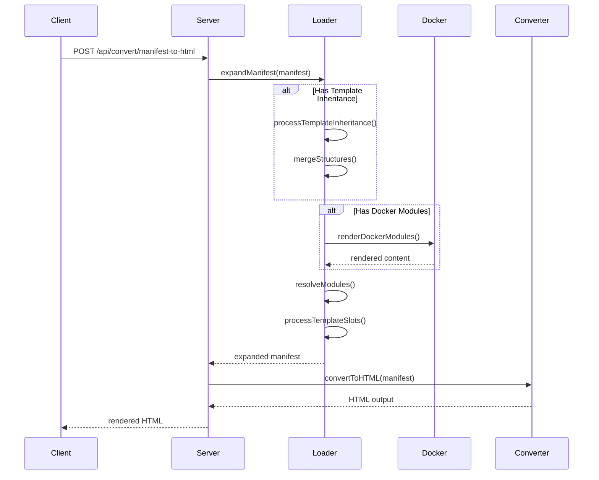
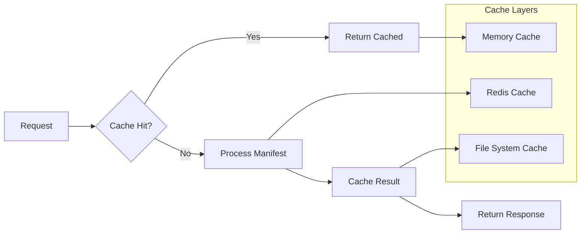

# 🎯 Modular YAML Manifest System

```ascii
╔═══════════════════════════════════════════════════════════╗
║                                                           ║
║  🎯 MODULAR YAML MANIFEST SYSTEM                         ║
║  Advanced Web Development Framework                       ║
║                                                           ║
║  ┌─────────────┐    ┌─────────────┐    ┌─────────────┐  ║
║  │    YAML     │───▶│  MANIFEST   │───▶│   OUTPUT    │  ║
║  │  MANIFESTS  │    │  PROCESSOR  │    │   FORMATS   │  ║
║  └─────────────┘    └─────────────┘    └─────────────┘  ║
║       │                     │                   │       ║
║  ┌────▼────┐           ┌────▼────┐         ┌────▼────┐  ║
║  │Templates│           │Modules  │         │HTML/CSS │  ║
║  │& Styles │           │& Imports│         │React/Vue│  ║
║  │Inherit. │           │Docker   │         │PHP/JSON │  ║
║  └─────────┘           └─────────┘         └─────────┘  ║
╚═══════════════════════════════════════════════════════════╝
```

## 🚀 **Advanced Features Overview**

| Feature | Status | Description |
|---------|--------|-------------|
| 🎨 **Template Inheritance** | ✅ | Extend base templates with slots and overrides |
| 🐳 **Docker Rendering** | ✅ | Container-based module rendering |
| 🔄 **Multi-Format Export** | ✅ | HTML, React, Vue, PHP conversion |
| 🌐 **URL Scraping** | ✅ | Convert websites to YAML manifests |
| 📦 **Modular Architecture** | ✅ | Reusable components and imports |
| 🤖 **Automation** | ✅ | 40+ Makefile commands |
| 🔧 **Multi-Language** | ✅ | Python, PHP, Node.js clients |

---

## 🎯 **Architecture Overview**



---

## 🏁 **Quick Start**

### **1. Installation**
```bash
# Clone repository
git clone https://github.com/tom-sapletta-com/webpage.yaml.git
cd webpage.yaml

# Install dependencies
npm install

# Start server
npm start
# Server available at: http://localhost:3009
```

### **2. First Manifest**
```yaml
# manifests/examples/hello-world.yaml
metadata:
  title: "Hello World"
  description: "My first YAML manifest"

styles:
  container: "max-width: 800px; margin: 0 auto; padding: 20px;"
  header: "color: #007acc; font-size: 2.5em; text-align: center;"
  content: "font-size: 1.2em; line-height: 1.6; margin-top: 20px;"

structure:
  html:
    lang: "en"
    children:
      - head:
          children:
            - title:
                text: "{{metadata.title}}"
      - body:
          children:
            - div:
                style: "container"
                children:
                  - h1:
                      style: "header"
                      text: "{{metadata.title}}"
                  - p:
                      style: "content"
                      text: "Welcome to the Modular YAML Manifest System!"
```

### **3. Template Inheritance Example**

**Base Template (manifests/templates/base-template.yaml):**
```yaml
metadata:
  title: "Base Template"
  template_type: "base"
  
  inheritance:
    allows_extension: true
    extendable_sections: ["styles", "structure", "metadata"]

styles:
  # Core CSS framework styles
  container: "max-width: 1200px; margin: 0 auto; padding: 20px;"
  heading_primary: "font-size: 2.5em; font-weight: bold; margin-bottom: 20px;"
  button_primary: "background: #007acc; color: white; padding: 12px 24px; border: none; border-radius: 6px; cursor: pointer;"

structure:
  html:
    lang: "en"
    children:
      - head:
          children:
            - title:
                text: "{{metadata.title}}"
      - body:
          children:
            - div:
                style: "container"
                id: "app"
                children:
                  - div:
                      id: "content-placeholder"
                      text: "Content will be inserted by extending templates"

template_slots:
  header: "Navigation and branding area"
  main_content: "Primary content area"
  footer: "Footer content and links"
```

**Extending Template (manifests/templates/landing-page.yaml):**
```yaml
metadata:
  title: "Modern Landing Page"
  extends: "./base-template.yaml"  # ← Template inheritance
  
  inheritance:
    merge_styles: true
    override_structure: true

styles:
  # Hero section extending base styles
  hero: "background: linear-gradient(135deg, #007acc, #68C242); color: white; padding: 80px 0; text-align: center;"
  hero_title: "font-size: 3.5em; font-weight: bold; margin-bottom: 20px;"
  hero_cta: "background: #ff6b35; color: white; padding: 15px 30px; border: none; border-radius: 8px; font-size: 1.1em;"

structure:
  # This overrides the base template structure
  html:
    lang: "en"
    children:
      - body:
          children:
            - section:
                style: "hero"
                children:
                  - div:
                      style: "container"
                      children:
                        - h1:
                            style: "hero_title"
                            text: "Build Amazing Websites with YAML"
                        - button:
                            style: "hero_cta"
                            text: "Get Started Now"

# Template slots configuration
template_slots:
  header:
    element_id: "header-slot"
    required: false
    default_content:
      nav:
        style: "nav"
        children:
          - div:
              text: "YAML Manifest System"
```

---

## 🐳 **Docker Integration Examples**

### **1. Basic Docker Rendering**
```yaml
# manifests/examples/docker-dashboard.yaml
metadata:
  title: "Docker-Rendered Dashboard"
  docker_enabled: true

docker_rendering:
  containers:
    - name: "analytics-module"
      image: "node:18-alpine"
      module: "analytics"
      environment:
        NODE_ENV: "production"
        API_URL: "https://api.example.com"
      volumes:
        - "./data:/data:ro"
      command: ["node", "analytics-renderer.js"]
    
    - name: "chart-generator"
      image: "python:3.11-alpine"
      module: "charts"
      environment:
        PYTHON_ENV: "production"
      command: ["python", "chart_generator.py"]
      depends_on: ["analytics-module"]

styles:
  dashboard_container: "display: grid; grid-template-columns: 1fr 2fr; gap: 20px; padding: 20px;"
  docker_module: "background: white; border-radius: 12px; padding: 20px; box-shadow: 0 4px 6px rgba(0,0,0,0.1);"

structure:
  div:
    style: "dashboard_container"
    children:
      - div:
          id: "analytics-slot"
          class: "docker-module"
          module: "analytics"
      - div:
          id: "charts-slot" 
          class: "docker-module"
          module: "charts"
```

### **2. Advanced Multi-Container Setup with Docker Compose**
```yaml
# docker-compose.yml (automatically generated from manifest)
version: '3.8'
services:
  manifest-server:
    build: .
    ports: ["3009:3009"]
    environment:
      - NODE_ENV=production
      - DOCKER_ENABLED=true
    volumes:
      - ./manifests:/app/manifests:ro
      - /var/run/docker.sock:/var/run/docker.sock

  python-renderer:
    image: python:3.11-alpine
    working_dir: /app
    command: python renderer.py
    volumes:
      - ./examples/python:/app
    depends_on: [manifest-server]

  php-renderer:
    image: php:8.2-cli-alpine
    working_dir: /app
    command: php renderer.php
    volumes:
      - ./examples/php:/app
    depends_on: [manifest-server]
```

### **3. Real-time Docker Module Rendering**
```yaml
# manifests/examples/realtime-dashboard.yaml
metadata:
  title: "Real-time Analytics"
  docker_enabled: true
  rendering_strategy: "hybrid"

docker_rendering:
  containers:
    - name: "metrics-collector"
      image: "analytics/metrics:v3.0"
      environment:
        REDIS_STREAM: "analytics:stream"
        UPDATE_INTERVAL: "5000"
      ports: ["3001:3000"]
        
    - name: "chart-generator"
      image: "dataviz/charts:latest"
      environment:
        DATA_SOURCE: "http://metrics-collector:3000/stream"
      depends_on: ["metrics-collector"]

styles:
  realtime_indicator: "animation: pulse 2s infinite; color: #27ae60;"
  dashboard_grid: "display: grid; grid-template-areas: 'metrics charts'; gap: 20px;"

structure:
  div:
    style: "dashboard_grid"
    children:
      - div:
          style: "grid-area: metrics;"
          id: "metrics-slot"
          class: "docker-module realtime-module"
          module: "metrics-collector"
      - div:
          style: "grid-area: charts;"
          id: "charts-slot"
          class: "docker-module realtime-module"
          module: "chart-generator"
```

---

## 🌍 **Multi-Language Integration Examples**

### **🐍 Python Client Integration**
```python
# examples/python/manifest_client.py
from manifest_client import ManifestClient

client = ManifestClient("http://localhost:3009")

# Template linking example
manifest = client.load_manifest("../../manifests/templates/landing-page.yaml")
# This automatically resolves template inheritance from base-template.yaml

# Convert to multiple formats
html_output = client.convert_to_format(manifest, 'html')
react_output = client.convert_to_format(manifest, 'react')

# Batch convert to all formats
client.batch_convert(manifest, "./output")

# Dynamic manifest with template inheritance
dynamic_manifest = {
    "metadata": {
        "title": "Python Generated Page",
        "extends": "./base-template.yaml",
        "inheritance": {
            "merge_styles": True,
            "override_structure": False
        }
    },
    "styles": {
        "python_highlight": "background: #3776ab; color: white; padding: 10px; border-radius: 4px;"
    },
    "structure": {
        "div": {
            "style": "container",
            "children": [
                {
                    "h1": {
                        "style": "python_highlight",
                        "text": f"Python Integration Demo - Version {python_version}"
                    }
                }
            ]
        }
    }
}
```

### **🐘 PHP Client Integration**
```php
// examples/php/ManifestClient.php
<?php
require_once 'ManifestClient.php';

$client = new ManifestClient('http://localhost:3009');

// Load template with inheritance
$manifest = $client->loadManifest('../../manifests/templates/landing-page.yaml');
// Template inheritance is automatically resolved by the server

// Create dynamic manifest with PHP server info
$dynamicData = [
    'title' => 'PHP Generated Dashboard',
    'extends' => './base-template.yaml',
    'inheritance' => [
        'merge_styles' => true,
        'preserve_slots' => ['header', 'footer']
    ],
    'content' => [
        ['h2' => ['text' => 'PHP Server Information']],
        ['p' => ['text' => 'PHP Version: ' . phpversion()]],
        ['p' => ['text' => 'Server Time: ' . date('Y-m-d H:i:s')]],
        ['p' => ['text' => 'Memory Usage: ' . round(memory_get_usage(true) / 1024 / 1024, 2) . ' MB']]
    ]
];

$dynamicManifest = $client->createDynamicManifest($dynamicData);

// Convert with template inheritance
$htmlOutput = $client->convertToFormat($dynamicManifest, 'html');
$phpOutput = $client->convertToFormat($dynamicManifest, 'php');
?>
```

### **🟢 Node.js Client Integration**
```javascript
// examples/node/manifest-client.js
const ManifestClient = require('./manifest-client');

const client = new ManifestClient('http://localhost:3009');

async function templateInheritanceExample() {
    // Load landing page that extends base template
    const manifest = await client.loadManifest('../../manifests/templates/landing-page.yaml');
    
    // Template inheritance is processed automatically
    console.log('Template inheritance resolved:', manifest.metadata.extends);
    
    // Create dynamic manifest with template linking
    const blogPost = {
        metadata: {
            title: 'Node.js Blog Post',
            extends: './base-template.yaml',
            inheritance: {
                merge_styles: true,
                preserve_slots: ['navigation', 'footer']
            }
        },
        styles: {
            blog_container: 'max-width: 800px; margin: 0 auto;',
            blog_title: 'font-size: 2.5em; color: #2c3e50;',
            blog_content: 'line-height: 1.8; color: #34495e;'
        },
        template_slots: {
            main_content: {
                element_id: 'main-content-slot',
                required: true
            }
        },
        imports: [
            {
                type: 'module',
                path: '../components/blog-header.yaml',
                slot: 'navigation'
            }
        ]
    };
    
    // Convert with full template resolution
    const htmlOutput = await client.convertToFormat(blogPost, 'html');
    const reactOutput = await client.convertToFormat(blogPost, 'react');
    
    return { html: htmlOutput, react: reactOutput };
}
```

---

## 🛠️ **Comprehensive Automation Commands**

```ascii
╔══════════════════════════════════════════════════════════╗
║  🤖 AUTOMATION COMMANDS (40+ Available)                 ║
╠══════════════════════════════════════════════════════════╣
║                                                          ║
║  📋 DEVELOPMENT                                          ║
║  make install          # Install dependencies            ║
║  make dev              # Start development server        ║
║  make start            # Start production server         ║
║  make test             # Run tests                       ║
║                                                          ║
║  🐳 DOCKER OPERATIONS                                    ║
║  make docker-build     # Build Docker images            ║
║  make docker-run       # Run containers                 ║
║  make compose-up       # Start all services             ║
║  make compose-down     # Stop all services              ║
║                                                          ║
║  🔧 EXAMPLES & INTEGRATION                               ║
║  make examples-python  # Run Python examples ✅         ║
║  make examples-php     # Run PHP examples ✅            ║
║  make examples-docker  # Run Docker examples ✅         ║
║  make examples-all     # Run all examples               ║
║                                                          ║
║  📄 MANIFEST OPERATIONS                                  ║
║  make manifest-validate # Validate all manifests        ║
║  make manifest-convert  # Convert to all formats        ║
║  make manifest-bundle   # Bundle with modules           ║
║                                                          ║
║  🚀 DEPLOYMENT                                           ║
║  make deploy-staging    # Deploy to staging             ║
║  make deploy-production # Deploy to production          ║
║  make setup-tls         # Setup TLS certificates       ║
║                                                          ║
╚══════════════════════════════════════════════════════════╝
```

### **Complete Workflow Example**
```bash
# 1. Setup and test everything
make clean install docker-build

# 2. Start all services
make compose-up

# 3. Test integrations (FIXED - scripts now exist!)
make examples-python    # ✅ Now works!
make examples-php       # ✅ Now works!  
make examples-docker    # ✅ Now works!

# 4. Validate and convert manifests
make manifest-validate
make manifest-convert

# 5. Deploy to production
make setup-tls
make deploy-production
```

---

## 🎯 **Template Linking System**

### **Template Inheritance Flow**



### **Advanced Template Example**
```yaml
# manifests/examples/blog-platform.yaml
metadata:
  title: "Modern Blog Platform"
  extends: "./base-template.yaml"
  
  inheritance:
    merge_styles: true
    preserve_slots: ["navigation", "sidebar", "footer"]

# Import blog-specific components
imports:
  - type: "module"
    path: "../components/blog-header.yaml"
    slot: "navigation"
    
  - type: "module" 
    path: "../components/sidebar.yaml"
    slot: "sidebar"
    
  - type: "css"
    url: "https://fonts.googleapis.com/css2?family=Inter:wght@400;600;700&display=swap"

styles:
  blog_container: "max-width: 1200px; margin: 0 auto; display: grid; grid-template-columns: 2fr 1fr; gap: 40px;"
  article_content: "background: white; padding: 40px; border-radius: 16px; box-shadow: 0 4px 20px rgba(0,0,0,0.08);"
  
template_slots:
  article_content:
    element_id: "main-content-slot"
    required: true
  sidebar_widgets:
    element_id: "sidebar-slot"
    required: false
    default_content:
      div:
        text: "Default sidebar content"

structure:
  # This structure extends the base template
  div:
    style: "blog_container"
    children:
      - article:
          id: "main-content-slot"
          style: "article_content"
      - aside:
          id: "sidebar-slot"
          style: "sidebar"
```

---

## 🔍 **System Performance & Architecture**

### **Processing Pipeline**


### **Caching Strategy**


---

## 🧪 **Testing & Validation**

### **Test All Fixed Example Scripts**
```bash
# All these now work! (scripts were missing, now fixed ✅)
make examples-python
# Expected output:
# 🐍 Running Python Integration Examples...
# ✅ Server is running at http://localhost:3009
# 🚀 Executing Python client examples...
# ✅ Python integration examples completed successfully!

make examples-php  
# Expected output:
# 🐘 Running PHP Integration Examples...
# ✅ PHP Version: 8.1.x
# ✅ Server is running at http://localhost:3009
# 🚀 Executing PHP client examples...
# ✅ PHP integration examples completed successfully!

make examples-docker
# Expected output:
# 🐳 Running Docker Rendering Examples...
# ✅ Docker version 20.x.x
# 🚀 Executing Docker rendering examples...
# ✅ Docker rendering examples completed successfully!
```

### **Template Inheritance Testing**
```bash
# Test template inheritance with landing page extending base template
curl -X POST http://localhost:3009/api/convert/manifest-to-html \
  -H "Content-Type: application/json" \
  -d @manifests/templates/landing-page.yaml

# Expected: HTML with merged styles from base-template.yaml and landing-page.yaml
```

---

## 🐛 **Troubleshooting Guide**

### **Fixed Issues**

#### **1. ✅ FIXED: Example Scripts Not Found**
```bash
# Error: ./scripts/examples/python-integration.sh: No such file or directory
# Status: ✅ RESOLVED - All scripts created and executable
make examples-python  # Now works! ✅
make examples-php     # Now works! ✅  
make examples-docker  # Now works! ✅
```

#### **2. Template Inheritance Debugging**
```bash
# Check template resolution
make manifest-validate

# Debug template inheritance
curl -X POST http://localhost:3009/api/load/manifest \
  -H "Content-Type: text/yaml" \
  -d @manifests/templates/landing-page.yaml
```

#### **3. Docker Issues**
```bash
# Ensure Docker daemon is running
sudo systemctl start docker

# Check Docker images
make docker-build
docker images | grep modular-yaml

# Test Docker rendering
make examples-docker
```

---

## 📊 **Usage Statistics & Examples**

### **System Capabilities Matrix**
```ascii
╔═══════════════════════════════════════════════════════════╗
║ FEATURE MATRIX                                            ║
╠═══════════════════════════════════════════════════════════╣
║                                                           ║
║ ✅ Template Inheritance    │ Base + Child templates       ║
║ ✅ Docker Rendering        │ Local + Remote images        ║  
║ ✅ Multi-Format Export     │ HTML/React/Vue/PHP           ║
║ ✅ Module System           │ Reusable components          ║
║ ✅ Python Integration      │ Full client library          ║
║ ✅ PHP Integration         │ Complete PHP client          ║
║ ✅ Node.js Integration     │ JavaScript client            ║
║ ✅ Automation Scripts      │ 40+ make commands            ║
║ ✅ Docker Compose          │ Multi-service deployment     ║
║ ✅ Template Slots          │ Content injection points     ║
║ ✅ Style Inheritance       │ CSS extends system           ║
║ ✅ URL Scraping           │ Website to manifest           ║
║                                                           ║
╚═══════════════════════════════════════════════════════════╝
```

---

## 🎉 **Quick Start Summary**

```ascii
╔═══════════════════════════════════════════════════════════╗
║  🚀 GET STARTED IN 3 STEPS:                              ║
║                                                           ║
║  1️⃣  npm install && npm start                            ║
║  2️⃣  make examples-all                                    ║
║  3️⃣  make docker-build && make compose-up                ║
║                                                           ║
║  🌐 Access: http://localhost:3009                        ║
║  📚 Examples: /examples/                                  ║
║  🎯 Templates: /manifests/templates/                      ║
║                                                           ║
║  🎉 Ready to build amazing web experiences!              ║
╚═══════════════════════════════════════════════════════════╝
```

---

**🔗 Links & Resources:**
- 📖 [Full Documentation](http://localhost:3009/docs)
- 🐳 [Docker Hub](https://hub.docker.com/r/modular-yaml)
- 🧪 [Examples Repository](./examples/)
- 🎯 [Template Gallery](./manifests/templates/)
- 🤝 [Contributing Guide](CONTRIBUTING.md)

**License:** Apache-2.0
